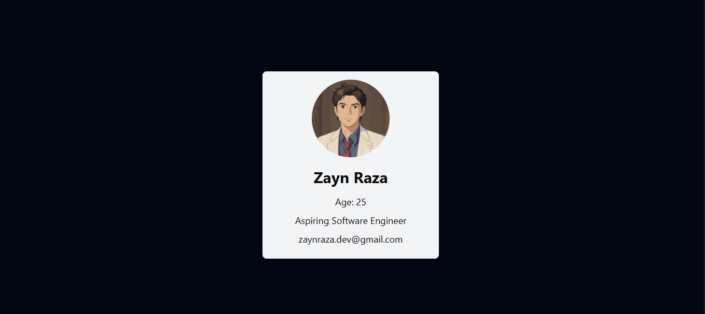

# 🚀 React Learning Journey

Welcome! 👋  
This repository contains my hands-on practice and mini-projects as I learn **React JS** — part of my journey to becoming a MERN Stack Developer.

---

## 📚 What’s Included?

This project includes:

- ✅ Basic JSX syntax
- ✅ Functional components
- ✅ Props and dynamic rendering
- ✅ useState (coming soon!)
- ✅ Reusable UI components
- ✅ Clean and readable code

---

## 🧠 Why This Repo?

I'm learning React and using this repository to:

- Practice coding with real examples
- Track my progress
- Share my work with others
- Get feedback from the developer community

---

## 📂 Folder Structure

```
src/
├── App.jsx
├── components/
│   └── ProfileCard.jsx
└── index.js
```

---

## 💡 How to Run Locally

1. Clone the repo:

   ```bash
   git clone https://github.com/zayndotdev/learning-react.git
   cd learning-react
   ```

2. Install dependencies:

   ```bash
   npm install
   ```

3. Start the development server:
   ```bash
   npm run dev   # or `npm start` if using Create React App
   ```

---

## 🛠️ Tech Stack

- [React](https://react.dev/)
- [Vite](https://vitejs.dev/) or [Create React App](https://create-react-app.dev/)
- JavaScript (ES6+)
- Git + GitHub for version control

---

## 🌱 Status

🔄 Currently Learning:  
**JSX**, **Components**, and **Props**

✅ Coming Soon:

- State management with `useState`
- Events & forms
- React Router
- Full-stack integration with MongoDB & Express

---

## 📬 Feedback

If you're also learning React, feel free to clone this repo, try things out, or suggest improvements!  
Let’s grow together. 💪

---

## 📸 Screenshot (Optional)



```

---

## 📌 Author

**Zayn**
Aspiring MERN Stack Developer
📧 [zaynraza.dev@gmail.com]
```
