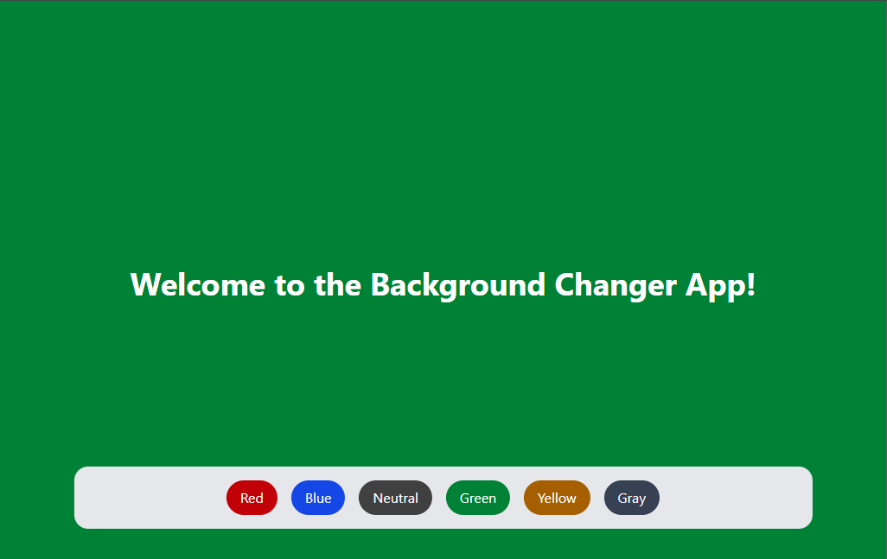

# 🎨 Gradient Background App

A simple React application that lets users change the background color of the entire screen using color buttons. This project demonstrates the use of React state management (`useState`), dynamic styling with Tailwind CSS, and best practices for scalable UI development.

## 🚀 Features

- Dynamic background color switching
- Clean, responsive UI using Tailwind CSS
- Scalable and DRY code with `.map()` for button generation
- Smooth transition effects
- Easily extendable color list

## 🛠️ Tech Stack

- React (with Vite or CRA)
- Tailwind CSS
- JavaScript (ES6+)

## 📂 Folder Structure

```
src/
├── App.jsx          # Main component with background logic
├── main.jsx         # Entry point
└── index.css        # Tailwind CSS imports
```

## 🧠 How It Works

- `useState` is used to track the current background class.
- A color map (`colorClasses`) stores Tailwind-compatible background classes.
- Buttons are dynamically rendered using `Object.keys()` and `.map()`.
- On button click, the background class is updated via `setBgColor()`.

## 📦 Getting Started

### 1. Clone the Repository

```bash
cd bg-changer
```

### 2. Install Dependencies

```bash
npm install
```

### 3. Start the Development Server

```bash
npm run dev
```

### 4. Build for Production

```bash
npm run build
```

## 🧪 Demo Preview



## ✨ Future Improvements

- Add custom color picker
- Support gradients and animated transitions
- Save theme preference in localStorage

## 🧑‍💻 Author

Zayn – [LinkedIn](https://linkedin.com/in/hafizzaynraza)

## 📄 License

This project is open-source and available under the [MIT License](LICENSE).
