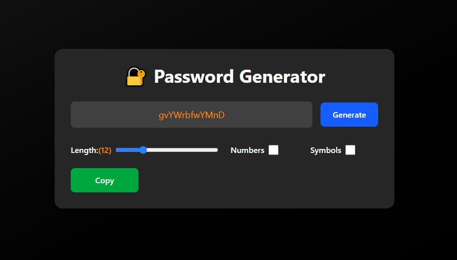

# 🔐 React Password Generator

A sleek, responsive, and fully functional **Password Generator** built using **React.js** and styled with **Tailwind CSS**. This app allows users to generate strong, customizable passwords with options for length, numbers, and symbols.

## 📸 Demo



## 🚀 Features

- ✅ Generate strong, random passwords
- ✅ Toggle inclusion of numbers and symbols
- ✅ Adjustable password length (8–24)
- ✅ Copy to clipboard functionality with feedback
- ✅ Fully responsive design
- ✅ Clean dark-themed UI with modern design
- ✅ Accessible and keyboard-friendly

## 🧠 What I Learned

While building this project, I practiced and implemented:

- 🔁 `useEffect` – for running password generation on mount and updates
- ⚙️ `useCallback` – to memoize the password generation function
- 📋 `useRef` (optional for advanced copy interaction)
- 💡 State and event handling using `useState`
- 🎨 UI building with Tailwind CSS
- ✨ Responsive layouts with grid and flexbox
- ⚠️ Handling edge cases and dynamic inputs

This project strengthened my understanding of **React hooks**, state management, and modern UI development.

## 🛠️ Technologies Used

- **React.js**
- **Tailwind CSS**
- **JavaScript (ES6+)**

## 📂 Folder Structure

```
📦 password-generator
├── 📁 public
├── 📁 src
│   ├── App.jsx
│   └── index.js
├── tailwind.config.js
├── postcss.config.js
├── package.json
└── README.md
```

## 🧪 How to Run Locally

1. **Clone the repository:**

```bash
git clone https://github.com/zayndotdev/password-generator.git
cd password-generator
```

2. **Install dependencies:**

```bash
npm install
```

3. **Start the development server:**

```bash
npm run dev
```

4. Open `http://localhost:5173` in your browser.

> This app was built using **Vite** for faster development.

## 📌 Future Improvements

- Add password strength meter
- Enable download/export feature
- Add light/dark mode toggle
- Save preferences using localStorage

## 🧑‍💻 Author

👋 Hi, I'm **Zayn** — a passionate developer currently diving deep into the **MERN stack**.

- [Portfolio](https://your-portfolio-link.com)
- [GitHub](https://github.com/zayndotdev)
- [LinkedIn](https://linkedin.com/in/hafizzaynraza)

## 📄 License

This project is open-source and available under the [MIT License](LICENSE).

---

Feel free to fork and contribute! Happy coding! 🔐✨
